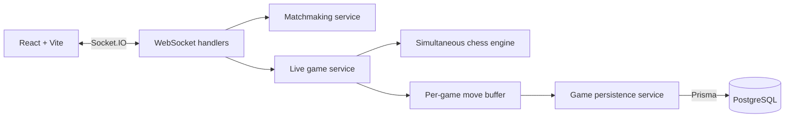

# Architecture

Checkless separates realtime transport, authoritative game logic, ephemeral
state, and durable persistence. The React client renders server decisions; it
never decides move legality, player color, sequence, captures, or results.

## System overview

## Backend module boundaries

- `src/websocket`: validates socket payloads and publishes service results.
- `src/services/matchmaking.js`: owns the ephemeral casual queue.
- `src/services/live-game.js`: owns active engines, timers, sequence allocation,
  idempotency, and terminal lifecycle coordination.
- `src/services/move-write-buffer.js`: batches and serializes move writes.
- `src/services/game-persistence.js`: owns all Prisma game mutations and
  transaction invariants.
- `src/middlewares`: authenticates requests and attaches verified local users.
- `src/engine`: validates and applies Checkless rules without database or socket
  dependencies.
- `src/utils`: contains pure mappings and CMN formatting/parsing.
- `prisma/schema`: defines durable models and constraints.

Routes will use the same services when public history and replay APIs are
implemented. They must not duplicate persistence logic.

## Durable and ephemeral state

PostgreSQL stores started games, participant snapshots, accepted moves, final
results, and the highest durable sequence. Memory stores active board objects,
cooldowns, socket membership, queue entries, idempotency results, and pending
move batches.

A `Game` and its two `GameParticipant` rows are created atomically before
`game_start` is emitted. The database-generated game ID is also the Socket.IO
room ID.

## Accepted-move pipeline

For every accepted move, the live game service:

1. Resolves color from verified game membership.
2. Detects a repeated `clientMoveId` before applying the engine command.
3. Validates and applies the move synchronously.
4. Allocates the next game-wide sequence.
5. Generates server-owned CMN and the resulting FEN.
6. Adds the structured record to the in-memory buffer.
7. Emits `move_made` immediately without waiting for PostgreSQL.

The client supplies only `gameId`, `clientMoveId`, and coordinates. See
`docs/CMN.md` for the notation contract.

## Batched persistence

Each game has one `MoveWriteBuffer`. It flushes when either limit is reached:

- 10 pending moves, configurable with `MOVE_BATCH_SIZE`;
- 5 seconds after the first pending move, configurable with
  `MOVE_FLUSH_INTERVAL_MS`.

Only one batch for a game can write at a time. A transaction inserts the
contiguous `GameMove` rows and conditionally advances `Game.lastSequence` from
the expected previous value to the batch's final sequence. The transaction
rolls back if either operation fails.

New moves can enter memory while an earlier batch is being written. They enter
the next serialized batch and cannot overtake the earlier moves.

## Terminal events and failures

King capture, abort, disconnect forfeit, and graceful shutdown stop new moves
and force the final buffer to flush. Game result updates run only after the
final durable sequence is confirmed.

If a batch fails, its moves are retained in memory, later writes are stopped,
players receive `SERVER_INTERRUPTED`, and the durable game is marked
`INTERRUPTED`. The server never skips a failed sequence and stores a later one.

At startup, database games still marked `ACTIVE` are changed to `INTERRUPTED`
with `SERVER_INTERRUPTED`. V1 does not recover a live engine across processes.
At most the current unflushed batch can be absent after an ungraceful crash.

## Scaling boundary

This design supports one backend process. Multiple instances require sticky
game routing or an external owner for queues, active engines, idempotency maps,
and timers. PostgreSQL remains the history store; it must not be used as the
100 ms timer or presence system.
