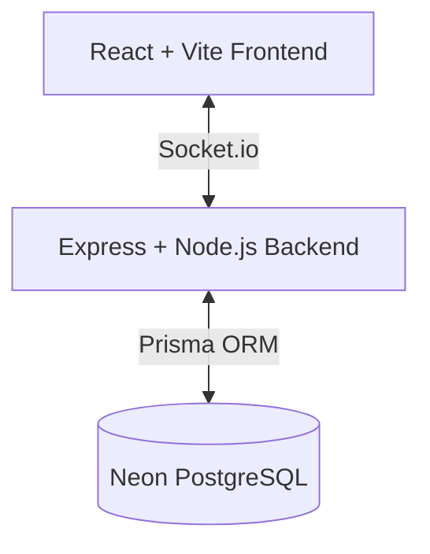

# Architecture

Checkless is built with a simple, modular architecture separating the frontend client from the backend game server. 
It uses a modern tech stack centered around React, Express, Socket.io, and Prisma.

## Overview

### 1. Frontend (`/frontend`)
The frontend is a pure Single Page Application (SPA) built with:
- **React 19**: UI component model.
- **Vite**: Ultra-fast build tool and development server.
- **TailwindCSS v3**: Utility-first CSS for styling, using a custom "espresso and lime" design system.
- **React Router**: Client-side routing.
- **Socket.io-client**: Real-time duplex communication with the game server.
- **Chessground**: Premium, customizable chess board UI.

The frontend is completely stateless regarding the game rules. It merely sends moves (and premoves) to the server and faithfully renders the board state and timers provided by the server.

### 2. Backend (`/backend`)
The backend is a Node.js server handling game logic and matchmaking:
- **Express**: Lightweight HTTP framework (primarily for health checks and API routes).
- **Socket.io**: Powers the realtime matchmaking and live game updates.
- **Prisma**: Type-safe ORM for database interactions.
- **Neon**: Serverless PostgreSQL database.

#### Core Modules
- **`src/index.js`**: The entry point. Initializes Express and Socket.io, binds them to a single HTTP server, and loads CORS configuration.
- **`src/socket/handlers.js`**: The central nervous system. Manages the connection lifecycle, matchmaking queues, game loop, and the global tick timer (which fires every 100ms).
- **`src/engine/chess.js`**: The authoritative game engine. `SimultaneousChess` class manages board state (FEN), timers, turn control, and game-over conditions (King Capture).
- **`src/utils/validate.js`**: Pure functions for chess move validation. Ensures pieces move correctly and prevents cheating.

## State Management

1. **Matchmaking**: Players request a game via `find_game` with a specific variant (1s, 3s, or 5s). The server queues them. When two players match, a new `SimultaneousChess` instance is created and stored in memory.
2. **Game Loop**: A global `setInterval` running every 100ms ticks down active timers for all games in memory. When a timer reaches 0, the player can move.
3. **Move Resolution**: When a player moves, the server validates it. If valid, the move is applied, the board state is updated, the player's timer resets to the variant max, and all clients in the room receive the `move_made` event.
4. **Win Condition**: If a King is captured during a move, the game ends immediately (`game_over` event with reason `KING_CAPTURED`).

## Future Expansion
The architecture is designed to support:
- **Ranked Matchmaking**: Adding user accounts, Elo ratings, and match history via the existing Prisma schema.
- **Private Friend Rooms**: Allowing players to create direct lobby codes to share with friends.
